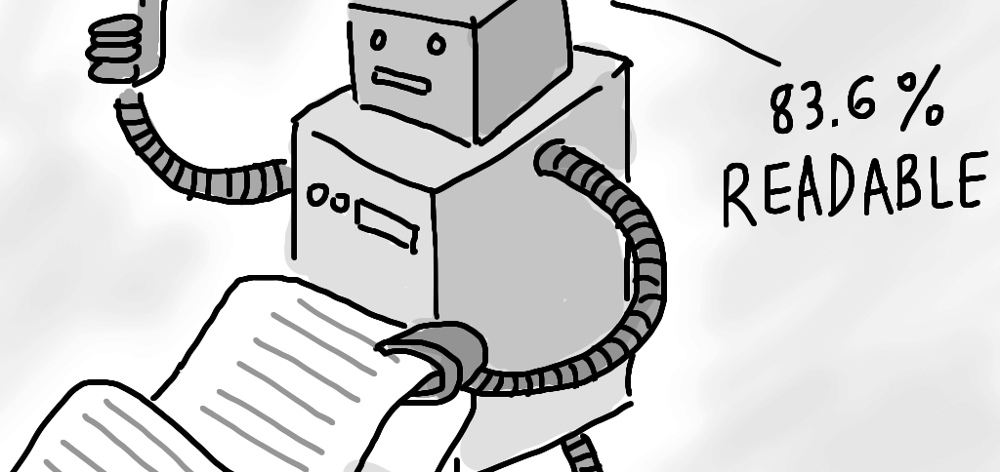

# Readability Index



This program computes the approximate grade level needed to comprehend some text. For instance, E.B.White's "Charlotte's Web" is between a second and fourth grade reading level, while "The Great Gatsby" by F.Scott Fitzgerald is between ninth and twelveth grade reading level. But how might one go about deciding the grade levels of books and texts? What constitutes as being at higher reading levels? One might guess longer words and sentences would correlate with higher reading levels. Over the years, a number of 'readability tests' have been developed by experts and in this program, I am using Coleman-Liau index. 

# Coleman-Liau Index

This readability test is designed to output the U.S. grade level needed to understand a given text. The formula is: 

```
index = 0.0588 * L - 0.296 * S - 15.8
```

Here, L is the average number of letters per 100 words in the text, and S is the average number of sentences per 100 words in the text.

For instance, if user types in a line from Dr. Seuss: 

```
$ ./readability
Text: Congratulations! Today is your day. You're off to Great Places! You're off and away!
Grade 3
```

The text the user inputted has 65 letters, 4 sentences, and 14 words. 65 letters per 14 words is an average of about 464.29 letters per 100 words. And 4 sentences per 14 words is an average of about 28.57 sentences per 100 words. Plugged into the Coleman-Liau formula, and rounded to the nearest whole number, we get an answer of 3: so this passage is at a third grade reading level.


# How to run the programs?

1. Compile by running make readability or clang -o readability readability.c -lcs50 in terminal
2. Run the program by running ./readability


# Word of caution when compiling

You must install CS50 library for C in order to compile and link it using -lcs50 flag. Installation guide is [here](https://cs50.readthedocs.io/library/c/).